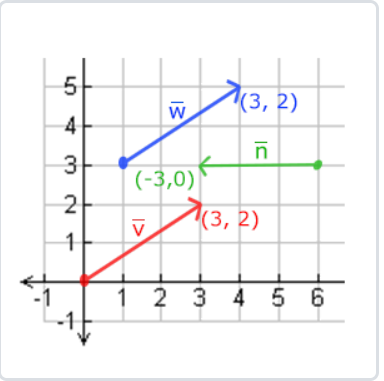
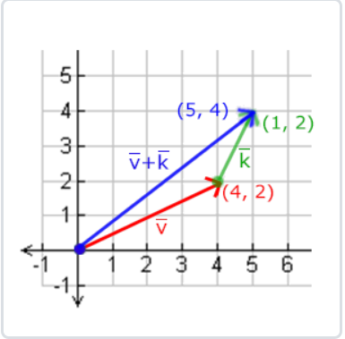
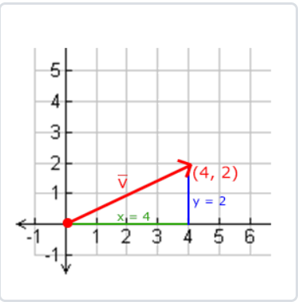
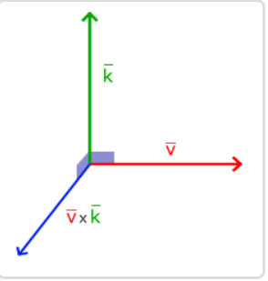
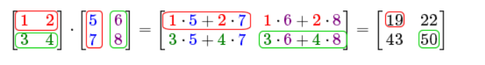
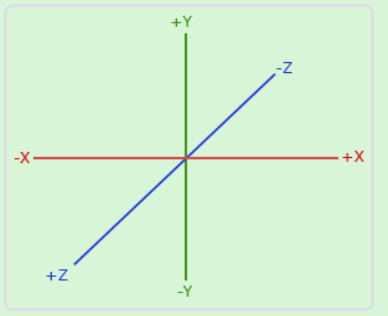
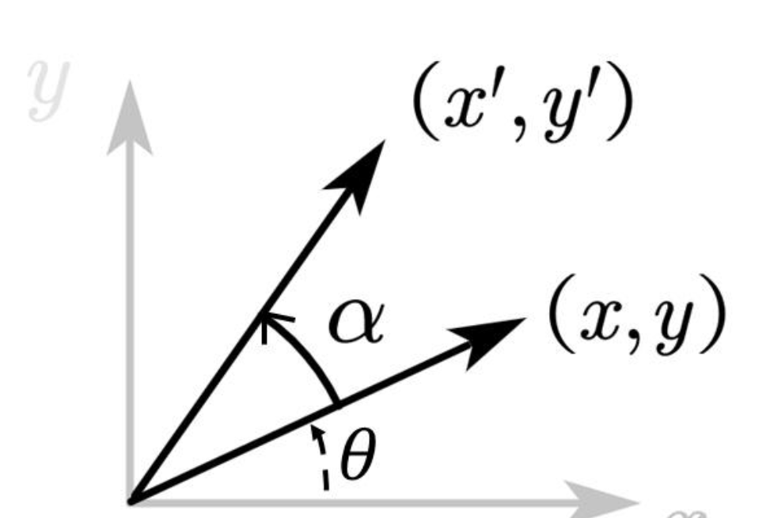
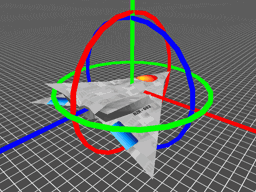

### 向量
* 标量 或者叫着数量 只有大小的量

* 向量是一个矢量，具有方向和大小也叫长度。

每个向量在2D图像中都是用一个箭头 $\left  ( x,y\right )$   表示。

 一个三维向量通常在数学上这么表示
$$
\bar v  = \begin{pmatrix}
x\\
y\\
z\\
\end{pmatrix}
$$

由于向量是具有方向的，通常设定这个方向的原点为(0, 0, 0)，然后指向一个方向。
#### 向量和标量的运算
数学上并没有向量与标量想加的运算,但是很多线性代数库都支持。
当把一个向量加、减、乘、除一个标量，可以简单的把向量的每一个分量分别进行改运算。 对于加法就像:

$$
\bar v  = \begin{pmatrix}
1\\
2\\
3\\
\end{pmatrix} 
+  x = \begin{pmatrix}
1 + x \\
2 + x \\
3 + x \\
\end{pmatrix} 
$$
其中的+可以是+，-，·或÷，其中·是乘号。注意－和÷运算时不能颠倒（标量-/÷向量），因为颠倒的运算是没有定义的。
#### 向量取反
对一个向量取反(Negate)会将其方向逆转。

$$
\bar v  = \begin{pmatrix}
1\\
2\\
3\
\end{pmatrix} 
 = - \begin{pmatrix}
1  \\
2  \\
3 \\ 
\end{pmatrix} =  \begin{pmatrix}
-1  \\
-2  \\
-3 \\ 
\end{pmatrix}
$$
#### 向量的加减

向量的加法可以被定义为是分量的(Component-wise)相加，即将一个向量中的每一个分量加上另一个向量的对应分量：
$$ 
\bar v =  \begin{pmatrix} 1 \\ 2 \\ 3 \end{pmatrix}, 

\bar k =  \begin{pmatrix} 4 \\ 5 \\ 6 \end{pmatrix} \rightarrow \bar v + \bar k =  \begin{pmatrix} 1 + 4 \\ 2 + 5 \\ 3 + 6  \end{pmatrix} =  \begin{pmatrix} 5 \\ 7 \\ 9  \end{pmatrix} $$
向量 $\bar v$ 和向量  $\bar k$可以直观的表示：

#### 长度(向量的模)
对于2d向量 直接使用勾股定理来获取向量的长度。

因为两条边（x和y）是已知的，如果希望知道斜边v
的长度，我们可以直接通过勾股定理来计算：

$$ ||v|| = \sqrt{x^2 +  y ^2}$$
可以扩展都多维：

$$\||v|| = \sqrt{\sum_{i=1}^{n} v_i^2}$$

模长为1的向量称为单位向量。 可以用任意向量的每一个分量除以向量的长度得到单位向量:

  $$ \hat{n} = \frac{\vec{v}}{\|\vec{v}\|}$$

这个求得单位向量的过程叫做一个向量的标准化(归一化,Normalizing)。归一化后点乘就成了纯粹的方向运算了。 比如求解两个向量的夹角时等等需要用到标准化操作。
### 向量相乘

#### 点乘 DotProduct
数学定义 是 对应向量分量两两相乘之后求和的操作,公式如下:
$$\vec{v} \cdot \vec{k} = v_x k_x + v_y k_y$$

几何是两个向量的点乘等于它们的数乘结果乘以两个向量之间夹角的余弦值。 公式如下：
$$\vec{v} \cdot \vec{k} = \|\vec{v}\| \|\vec{k}\| \cos\theta$$

当 $\bar v \bar w$ 都是单位向量的情况下，点乘的值就是夹角的余弦 $\cos\theta$. 通过几何意义可以很容易判断 两个向量是否 平行 正交 和求得角度。
其他应用判断两个向量时候同向(前后方)， 计算向量v在k向量上的投影。

性质若下:
交换律：$\vec{v} \cdot \vec{k} = \vec{k} \cdot \vec{v}$

分配律：$\vec{v} \cdot (\vec{k} + \vec{j}) = \vec{v} \cdot \vec{k} + \vec{v} \cdot \vec{j}$

结合率：$(k\vec{v}) \cdot \vec{k} = k(\vec{v} \cdot \vec{k})$

#### 叉乘 CrossProduct

二维向量的的得到一个标量 到公式如下:
$$\vec{a} \times \vec{b} = a_x b_y - a_y b_x$$

几何意义：三维上叉乘，它需要两个不平行向量作为输入，产生一个与两个原向量都垂直的向量(垂直于二者构成的平面)。方向由右手定则确定：右手四指从 $\bar v$ 弯向  $\bar w$ ，拇指所指的方向就是新向量 的方向。

三维公式:
$$\vec{a} \times \vec{b} = \begin{pmatrix}
a_y b_z - a_z b_y \\
a_z b_x - a_x b_z \\
a_x b_y - a_y b_x
\end{pmatrix}$$

模长： 产生向量的模等于二个向量模的乘积与夹角正弦值的乘积,即二者向量构成平行四边形的面积， 公式如下：
$$\|\vec{a} \times \vec{b}\| = \|\vec{a}\| \|\vec{b}\| \sin\theta$$

应用 判断点是否在三角形的内部 平行 计算物体表面的法线向量

满足分配律:

$\mathbf{a} \times (\mathbf{b} + \mathbf{c}) = (\mathbf{a} \times \mathbf{b}) + (\mathbf{a} \times \mathbf{c})$

$(\mathbf{a} + \mathbf{b}) \times \mathbf{c} = (\mathbf{a} \times \mathbf{c}) + (\mathbf{b} \times \mathbf{c})$

### 矩阵

矩阵是一个由数字、符号或表达式排列成的矩形阵列。 一个m 行x n列矩阵表示如下:

$$A = \begin{pmatrix}
a_{11} & a_{12} & \cdots & a_{1n} \\
a_{21} & a_{22} & \cdots & a_{2n} \\
\vdots & \vdots & \ddots & \vdots \\
a_{m1} & a_{m2} & \cdots & a_{mn}
\end{pmatrix}$$

矩阵的加减:
* 可加的规则: 要求行列数相同
* 相加原则： 对应的元素两两相加,结果放到相同的位置.

加法：

$$
\begin{bmatrix}
1 & 3 \\
2 & 4 
\end{bmatrix}
+
\begin{bmatrix}
5 & 7 \\
6 & 8
\end{bmatrix}
=
\begin{bmatrix}
1+5 & 3+7 \\
2+6 & 4+8
\end{bmatrix}
=
\begin{bmatrix}
6 & 10 \\
8 & 12
\end{bmatrix} 
$$

减法 
$$
\begin{bmatrix}
4 & 1 \\
2 & 6
\end{bmatrix}
-
\begin{bmatrix}
2 & 0 \\
4 & 1
\end{bmatrix}
=
\begin{bmatrix}
4-2 & 1-0 \\
2-4 & 6-1
\end{bmatrix}
=
\begin{bmatrix}
2 & 1 \\
-2 & 5
\end{bmatrix}

$$

矩阵的乘法:
* 可乘的条件 只有当左边矩阵的列数与右边矩阵的函数相等,两个矩阵才能相乘。
* 相乘的理解 m1 * n 和 n * m2的矩阵相乘会得到 m1 * m2的矩阵

$$
kA = k \begin{bmatrix}
a_{11} & a_{12} & \cdots & a_{1n} \\
a_{21} & a_{22} & \cdots & a_{2n} \\
\vdots & \vdots & \ddots & \vdots \\
a_{m1} & a_{m2} & \cdots & a_{mn}
\end{bmatrix}
= \begin{bmatrix}
ka_{11} & ka_{12} & \cdots & ka_{1n} \\
ka_{21} & ka_{22} & \cdots & ka_{2n} \\
\vdots & \vdots & \ddots & \vdots \\
ka_{m1} & ka_{m2} & \cdots & ka_{mn}
\end{bmatrix}

$$

2×2矩阵相乘的例子如下:
$$
\begin{bmatrix}
a & b \\
c & d
\end{bmatrix}
\begin{bmatrix}
e & f \\
g & h
\end{bmatrix}
=
\begin{bmatrix}
ae + bg & af + bh \\
ce + dg & cf + dh
\end{bmatrix}
$$

性质:
* 满足结合律 $(AB)C = A(BC)$
* 满足分配律 $A(B + C) = AB + AC$
* 不满足交换率

单位矩阵 IdentityMatrix
* 必须N * N 矩阵
* 主对角线上的每个元素必须是1
* 除了主对角线外，其他元素为0
  
4阶单位矩阵:
$$ I_4 = \begin{bmatrix}
1 & 0 & 0 & 0 \\
0 & 1 & 0 & 0 \\
0 & 0 & 1 & 0 \\
0 & 0 & 0 & 1
\end{bmatrix} $$

缩放
对一个向量进行缩放(Scaling)就是对向量的长度进行缩放，而保持它的方向不变。
公式如下:
$$
\begin{bmatrix}
S_1 & 0 & 0  \\
0 & S_2 & 0 \\
0 & 0 & S_3 \\
\end{bmatrix}
\cdot
\begin{pmatrix}
x \\
y \\
z \\
\end{pmatrix}
=
\begin{pmatrix}
S_1 \cdot x \\
S_2 \cdot y \\
S_3 \cdot z \\
\end{pmatrix}
$$

位移

位移(Translation)是在原始向量的基础上加上另一个向量从而获得一个在不同位置的新向量的过程，从而在位移向量基础上移动了原始向量。我们把矩阵扩展到4*4举证，同时给向量一个 w行，所有位移的值都会加入到向量原来的原始值上.

向量的w分量也称为齐次坐标。想要从齐次向量得到3D向量，我们可以把x、y和z坐标分别除以w坐标。我们通常不会注意这个问题，因为w分量通常是1.0。使用齐次坐标有几点好处：它允许我们在3D向量上进行位移（如果没有w分量我们是不能位移向量的）。

位移公式就变成了如下:

$$
\begin{bmatrix}
1 & 0 & 0 & T_x \\
0 & 1 & 0 & T_y \\
0 & 0 & 1 & T_z \\
0 & 0 & 0 & 1
\end{bmatrix}
\cdot
\begin{pmatrix}
x \\
y \\
z \\
1
\end{pmatrix}
=
\begin{pmatrix}
x + T_x \\
y + T_y \\
z + T_z \\
1
\end{pmatrix}

$$

旋转 

欧拉角是欧拉引入用来描述刚体姿态的三个角，3D 空间中的任意一个旋转都可以拆分。
成为沿着物体自身三个正交坐标轴旋转的复合，而欧拉角就规定了这三次
旋转的角度，我们分别称他们为 yaw、pitch 和 roll。

设点 $P(x, y)$ 绕原点(绕每个轴旋转时，我们遵循右手法则：右手拇指指向旋转轴正方向 弯曲的四指指向旋转正方向)旋转角度 $\textcolor{yellow}{\theta}$，求旋转后的坐标 $P'(x', y')$。

可以得到
$$  \begin{align*}
x' &= r \cos(\alpha + \textcolor{yellow}{\theta}) \\
y' &= r \sin(\alpha + \textcolor{yellow}{\theta})
\end{align*}
$$
利用三角函数和角公式：

$$
\begin{align*}
x' &= r \cos\alpha \cos\textcolor{yellow}{\theta} - r \sin\alpha \sin\textcolor{yellow}{\theta} \\
y' &= r \sin\alpha \cos\textcolor{yellow}{\theta} + r \cos\alpha \sin\textcolor{yellow}{\theta}
\end{align*}
$$
由极坐标关系可知：
$$
\begin{align*}
r \cos\alpha &= x \\
r \sin\alpha &= y
\end{align*}
$$
代入得：
$$
\begin{align*}
x' &= x \cos\textcolor{yellow}{\theta} - y \sin\textcolor{yellow}{\theta} \\
y' &= x \sin\textcolor{yellow}{\theta} + y \cos\textcolor{yellow}{\theta}
\end{align*}
$$

因此，旋转后的坐标为：
$$
P'(x', y') = (x \cos\theta - y \sin\theta,\ x \sin\theta + y \cos\theta)
$$

旋转变换也可以用矩阵表示为：

$$
\begin{bmatrix}
x' \\
y'
\end{bmatrix}
=
\begin{bmatrix}
\cos\theta & -\sin\theta \\
\sin\theta & \cos\theta
\end{bmatrix}
\begin{bmatrix}
x \\
y
\end{bmatrix}
$$

同理可得:
变换矩阵：

Pitch(俯仰):  绕 X 轴旋转 $\theta$ 角度:
$$\begin{bmatrix}
1 & 0 & 0 & 0 \\
0 & \cos\theta & -\sin\theta & 0 \\
0 & \sin\theta & \cos\theta & 0 \\
0 & 0 & 0 & 1
\end{bmatrix}
\cdot
\begin{pmatrix}
x \\
y \\
z \\
1
\end{pmatrix}
=
\begin{pmatrix}
x \\
\cos\theta \cdot y - \sin\theta \cdot z \\
\sin\theta \cdot y + \cos\theta \cdot z \\
1
\end{pmatrix}$$

Yaw(偏航): 绕 Y 轴旋转 $\theta$ 角度:

$$
\begin{bmatrix}
\cos\theta & 0 & \sin\theta & 0 \\
0 & 1 & 0 & 0 \\
-\sin\theta & 0 & \cos\theta & 0 \\
0 & 0 & 0 & 1
\end{bmatrix}
\cdot
\begin{pmatrix}
x \\
y \\
z \\
1
\end{pmatrix}
=
\begin{pmatrix}
\cos\theta \cdot x + \sin\theta \cdot z \\
y \\
-\sin\theta \cdot x + \cos\theta \cdot z \\
1
\end{pmatrix}

$$

对于绕 Y 轴旋转：

* Y 轴正方向：向上

* 右手拇指向上，四指弯曲方向：从 Z 轴向 X 轴旋转

* 这导致了 sinθ 项符号的特殊性

Roll(翻滚):  绕 Z 轴旋转 $\theta$ 角度:

$$
\begin{bmatrix}
\cos\theta & -\sin\theta & 0 & 0 \\
\sin\theta & \cos\theta & 0 & 0 \\
0 & 0 & 1 & 0 \\
0 & 0 & 0 & 1
\end{bmatrix}
\cdot
\begin{pmatrix}
x \\
y \\
z \\
1
\end{pmatrix}
=
\begin{pmatrix}
\cos\theta \cdot x - \sin\theta \cdot y \\
\sin\theta \cdot x + \cos\theta \cdot y \\
z \\
1
\end{pmatrix}
$$

利用旋转矩阵我们可以把任意位置向量沿一个单位旋转轴进行旋转。也可以将多个矩阵复合，比如先沿着x轴旋转再沿着y轴旋转。
但是这会很快导致一个问题——[万向节死锁](https://www.youtube.com/watch?v=zc8b2Jo7mno)（Gimbal Lock）。

也可以通过沿着任意的一个轴，而不是对一系列旋转矩阵进行复合，可以有效的避免万向节死锁的问题。这样的一个（超级麻烦的）矩阵是存在的，见下面这个公式，其中(Rx,Ry,Rz)代表任意旋转轴：

$$
R = \begin{bmatrix}
\cos\theta + R_x^2(1-\cos\theta) & R_xR_y(1-\cos\theta) - R_z\sin\theta & R_xR_z(1-\cos\theta) + R_y\sin\theta & 0 \\
R_yR_x(1-\cos\theta) + R_z\sin\theta & \cos\theta + R_y^2(1-\cos\theta) & R_yR_z(1-\cos\theta) - R_x\sin\theta & 0 \\
R_zR_x(1-\cos\theta) - R_y\sin\theta & R_zR_y(1-\cos\theta) + R_x\sin\theta & \cos\theta + R_z^2(1-\cos\theta) & 0 \\
0 & 0 & 0 & 1
\end{bmatrix}

$$

### 矩阵的组合
我们可以把多个变换组合到一个矩阵中。让我们看看我们是否能生成一个变换矩阵，让它组合多个变换。假设我们有一个顶点(x, y, z)，我们希望将其缩放2倍，然后位移(1, 2, 3)个单位。我们需要一个位移和缩放矩阵来完成这些变换。结果的变换矩阵看起来像这样：

$$
Trans \cdot Scale \cdot v  = 
\begin{bmatrix}
1 & 0 & 0 & 0 \\
0 & 1 & 0 & 0 \\
0 & 0 & 1 & 0 \\
1 & 2 & 3 & 1
\end{bmatrix}
\cdot
\begin{bmatrix}
2 & 0 & 0 & 0 \\
0 & 2 & 0 & 0 \\
0 & 0 & 2 & 0 \\
0 & 0 & 0 & 1
\end{bmatrix}
\cdot
\begin{bmatrix}
x \\
y\\
z\\
1
\end{bmatrix}
=
\begin{bmatrix}
2 & 0 & 0 & 0 \\
0 & 2 & 0 & 0 \\
0 & 0 & 2 & 0 \\
1 & 2 & 3 & 1
\end{bmatrix}
\cdot
\begin{bmatrix}
x \\
y\\
z\\
1
\end{bmatrix}
=
\begin{bmatrix}
2x + 1 \\
2y + 2\\
2z + 3\\
1
\end{bmatrix}
$$

注意，当矩阵相乘时我们先写位移再写缩放变换的。矩阵乘法是不遵守交换律的，这意味着它们的顺序很重要。当矩阵相乘时，在最右边的矩阵是第一个与向量相乘的，所以你应该从右向左读这个乘法。
